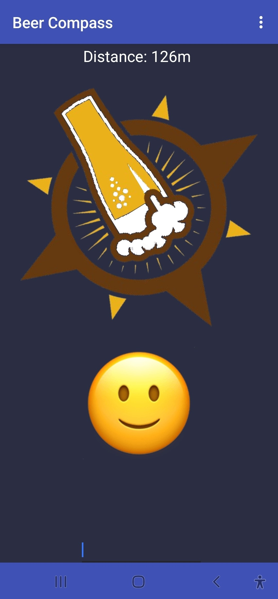
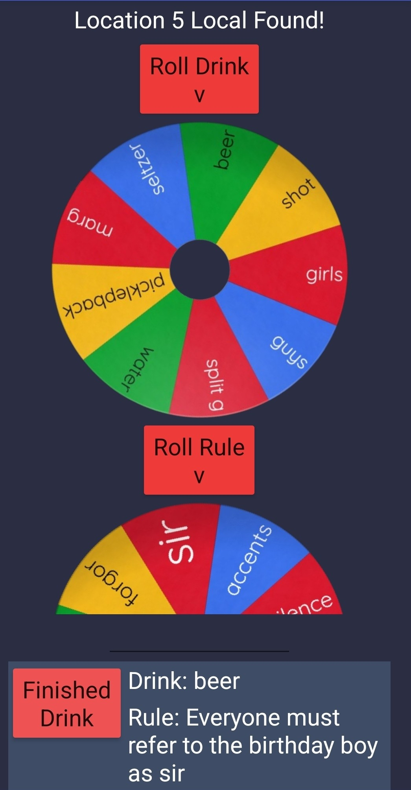

# Beer_Compass_App
MIT App inventor app that acts as a bar hopping compass. Includes spinner wheel to select a drink and fun rules for each bar.

Features:
* Uses GPS location and bearing to calculate the heading and point the compass toward the next bar.
* Uses Haversine Formula to calculate distance to next location. Images are displayed based on how close you are to the next bar.
* Phone vibration and pop ups to provide haptic feedback when the location has been reached.
* Uses TinyDB to store current state in "non volatile" memory. Allows the user to close the app, but save progress.
* Cheat code bypass in case of any unexpected issue.

The drink spinner and rule spinner can be respun again if desired.

Possible future additions:
* Allow users to manually enter locations instead of having to change the code.
* Allow users to enter custom rules/drinks to the spinner wheels. 
